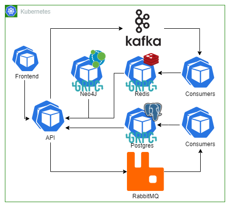
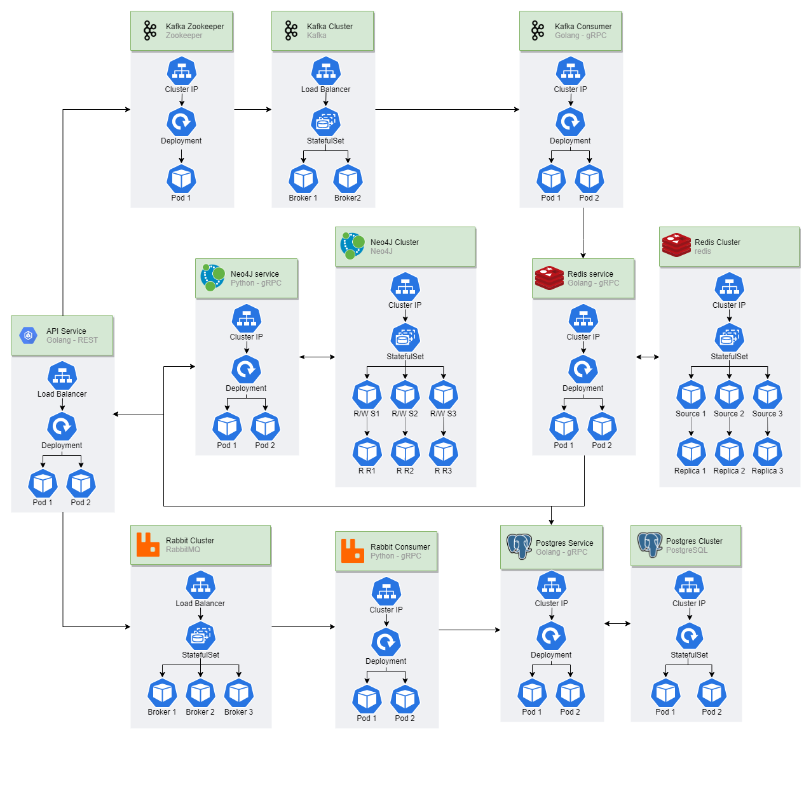

# CPH-Business-SI-Exam
System Integration Exam Assignment
# Table of Contents
  - [How to run](#how-to-run)
  - [The team](#the-team)
  - [Assignment](#assignment)
    - [Objectives](#objectives)
    - [Task](#task)
  - [Introduction](#introduction)
  - [Project Achitecture](#project-achitecture)
  - [Process](#process)

## How to run 

### Requirements
This system is quite heavy on memory when you run the last command. Make sure that you have allocated enough RAM to docker so that the build doesn't fail. The easiest option to allocate more resources to docker is to change the resource settings in Docker Desktop. If you're unsure how to do this, follow below. If you know how to allocate resources on docker for your system, you can jump to [First start up a minikube cluster](#first-start-up-a-minikube-cluster). 

#### **Windows**
NOTE: On newer systems, Docker Desktop uses the WSL 2 based engine, which provides better performance than Hyper-V backend. In our experience, WSL 2 used insane ammounts of memory without having any docker contains running. You can disable docker using WSL 2 under settings -> general -> untick "Use the WSL 2 based engine". It is possible to run with WSL 2, the choice is up to you. 

##### **WITHOUT WSL 2**
Go to settings -> resources and change the RAM. From our experience 6 GB seems to be minimal requirement, and optimal at 8 GB. After the build has finished it idles at 4 GB. 

##### **WITH WSL 2**
Docker provides a guide to configure advanced settings [here](https://docs.microsoft.com/en-us/windows/wsl/wsl-config#configure-global-options-with-wslconfig). But the quick rundown is as follows:

**run** 
```
# This will shut off WSL globaly, including for docker desktop

wsl -- shutdown

# Will create the file in your userprofile if it doesn't exist, and open it in notepad. 

notepad "$env:USERPROFILE/.wslconfig"
```

In this file you can add configurations for resources:
````
[wsl2]
kernel=<path>              # An absolute Windows path to a custom Linux kernel.
memory=<size>              # How much memory to assign to the WSL2 VM.
processors=<number>        # How many processors to assign to the WSL2 VM.
swap=<size>                # How much swap space to add to the WSL2 VM. 0 for no swap file.
swapFile=<path>            # An absolute Windows path to the swap vhd.
localhostForwarding=<bool> # Boolean specifying if ports bound to wildcard or localhost in the WSL2 VM should be connectable from the host via localhost:port (default true).

# <path> entries must be absolute Windows paths with escaped backslashes, for example C:\\Users\\adamc\\kernel
# <size> entries must be size followed by unit, for example 8GB or 512MB
````

We only need to allocate RAM and limit processors. So simply adding the following will allocate resources for docker.
````
[wsl2]
memory=8GB            
processors=4
````

You can add or remove resources as you need, we could run the project with this configuration. 

#### **MacOSX**
Go to settings -> resources and change the RAM. From our experience 6 GB seems to be minimal requirement, and optimal at 8 GB. After the build has finished it idles at 4 GB. 

#### First start up a minikube cluster
```
$ minikube start
```
#### In new terminal start up af minikube tunnel and let it run
```
$ minikube tunnel
```
#### Now run Terraform to apply the infrasturcture
```
$ cd terraform
$ terraform init
$ terraform apply --var-file=dev.tfvars -auto-approve
```

## The team
- [Andreas Vikke (cph-av105)](https://github.com/andreasvikke)
- [Asger Sørensen (cph-as466)](https://github.com/asgerhs)
- [Martin Frederiksen (cph-mf237)](https://github.com/MartinFrederiksen)
- [William Huusfeldt (cph-wh106)](https://github.com/WSHuusfeldt)

## Assignment
[Full assignment pdf](/assets/SI2021ExamProject.pdf)

### Objectives
The objective of this project is to enable you to demonstrate knowledge and skills acquired in the
System Integration course, in collaboration with the Development of Large Systems.

The project involves design, implementation, and documenting of integrated software system with a
business context.

The project solution, as well as short video-presentation of it must be submitted on-line before the
exam and discussed at the exam.

The development of the project is a teamwork, while the examination on it is individual. Every team
member is expected to be able to provide argumentation regarding the whole project and its parts,
as well as to highlight their own individual contribution to the solution.

### Task
Your task is to design, develop and implement modern integrated software system, which provides
business services and automates business processes, related to your customer’s domain of activities.
To fulfill the task, your team needs to:
1. Analyze the domain and identify potential problems in the existing legacy digital systems at
the customer, such as lack of functionality, performance issues, operation difficulties, data
storage and transformation issues, customer dissatisfaction, etc.

2. Select business cases and scenarios, where you can help solving the problems by applying
integration and modernization techniques.

3. Design the architecture of your integrated solution applying DDD approach.
   
4. Develop and deploy the solution on a local server and/or a cloud platform, while considering
readiness for scaling and load-balancing.

5. Advertise the final product in a short video clip.

### Requirements
As it is a project with particular learning objectives, it refers to the content you have learned and the
assignments you have developed during the semester. Therefore, you must consider the following
mandatory requirements and limitations of your exam project solution:

#### **1. System Components**

Subject of integration are several disparate applications, application components, and data
sources of three types:
1. a monolithic or legacy object-oriented application – for ex. file or large DB based
system, Client-Server or MVC architecture, any black-box or hidden application
2. SOAP/REST web services or SOA implementation – either locally built or exposed as
free resources in Internet
3. microservices architecture application or modules of application, including selected
discovery, orchestration, or choreography methods and technologies

#### **2. Business Context**
The integration architecture design reflects on the business context:
1. applies domain-driven design approach
2. includes BPMN models and rules
3. follows enterprise integration patterns, EIP
4. enables sharing, integration and transformation of data between system components,
data structures and file formats

#### **3. Integration Technologies**
The development implements variety of integration and communication techniques (the
technologies in the parentheses are examples)
1. both RESTful and gRPC APIs
2. . MOM – either brokerless (Apache Camel) or broker-based (ActiveMQ, RabbitMQ)
3. event streaming – (Apache Kafka)
4. business process automation – (Camunda)
5. microservices composition, discovery, and management – (Docker, Docker Compose,
Eureka, Netflix tools, Kubernetes

#### **4. Development Environments and QA**
The product also illustrates use of:
1. decoupling, configuration, choreography and orchestration of components
2. synchronous and asynchronous interaction styles
3. logging and monitoring the system or its components 
4. producing error messages in human-readable format
5. implementing variety of programming languages or development platforms
You can consider the Twelve-Factor App recommendations.

#### **5. Client Applications**
The product integration channels must be tested for both success and failure 
1. there is no requirement for developing a GUI-based client application 
2. publicly available means, such as Postman, curl, console CLI and web browsers, which
provide a simple interface for illustrating the functionality of the integrated system can
be used instead

## Introduction
We've decided to work on the book and vinyl subscription services provider. The entire project is run on a minikube cluster through terraform. The "legacy" system that this company has is an excel sheet that was previously used as their database collection of rentals and their catolog of books and vinyls. Before diving into the process of development, take a look at [Project Architecture](#project-achitecture), so that you have an understanding of how the system flows and how it's implemented. Thereafter we'll go through our [Process](#process), and discuss how we ended up with our chosen design, up to the end result. 


## Project Achitecture
Our first architecture drawing was a pretty rough illistration of what we wanted to do, and how we would handle the assignment. As shown, we have a frontend that is connected to an API. When a customer looks at a book or vinyl, it is sent through kafka, and logged in redis. Should a user want to rent a book or vinyl, a request is sent to RabbitMQ, where the message is consumed and the information saved to postgres. 
#### Architecture Diagram version 1.


Our second architecture drawing is a bit more detailed, showing services and clusters, as well as what each contains. But still following our first architecture drawing in the flow of the application. Although not shown like in the first drawing, the application is still running on kubernetes using minikube and terraform. 
#### Architecture Diagram version 2.


## Process

### Beginning
After the team had decided which of the projects to work on, we started with sketching an architecture diagram, and discussing how to structure the project while going through the requirements of the project. This is how the [first version](#architecture-diagram-version-1) of our architecture was made. We went through the requirements again and made sure that it would fufill them.

### Development and setup
As our first architecture drawing illustrates, we wanted to deploy our system to a kubernetes cluster using minikube and terraform. 

## Scalability
The system that we have built is pretty strong on scalability. Kubernetes clusters include load balancers as shown on [the second architecture drawing](#architecture-diagram-version-2). As the system scales, the difference between read and writes increases. With the use case we've built from, the system would need more read replicas as it grew in size and the number of users increased. This would mainly affect redis, as it logs users actions during user flow. 

## Further Development
Any further development of the project after hand in date will be noted here. 
