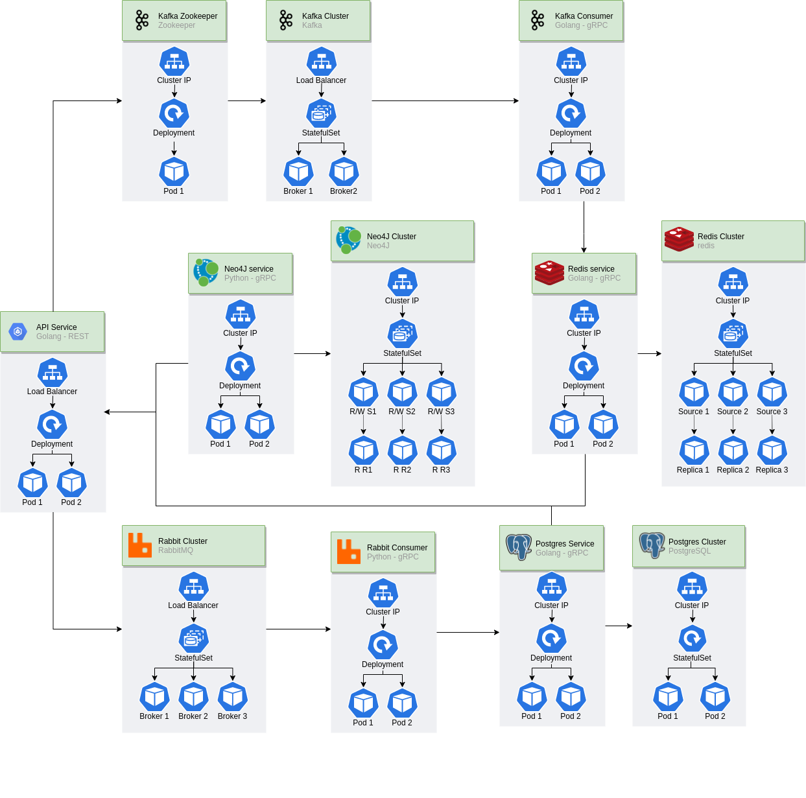

# CPH-Business-SI-Exam
System Integration Exam Assignment
# Table of Contents
  - [How to run](#how-to-run)
  - [The team](#the-team)
  - [Assignment](#assignment)
    - [Objective](#objective)
    - [Task](#task)
  - [Introduction](#introduction)
  - [Project Achitecture](#project-achitecture)

## How to run 

#### First start up af minikube cluster
```
$ minikube start
```
#### In new terminal start up af minikube tunnel and let it run
```
$ minikube tunnel
```
#### Now run Terraform to apply the infrasturcture
```
$ cd terraform
$ terraform init
$ terraform apply --var-file=dev.tfvars -auto-approve
```

## The team
- [Andreas Vikke (cph-av105)](https://github.com/andreasvikke)
- [Asger Sørensen (cph-as466)](https://github.com/asgerhs)
- [Martin Frederiksen (cph-mf237)](https://github.com/MartinFrederiksen)
- [William Huusfeldt (cph-wh106)](https://github.com/WSHuusfeldt)

## Assignment
TODO: Insert Assignment PDF
## Introduction
TODO: Write this

## Project Achitecture
